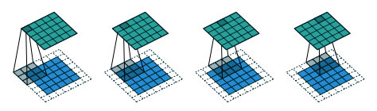
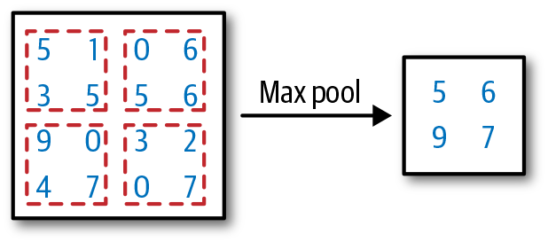
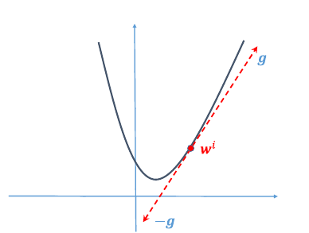
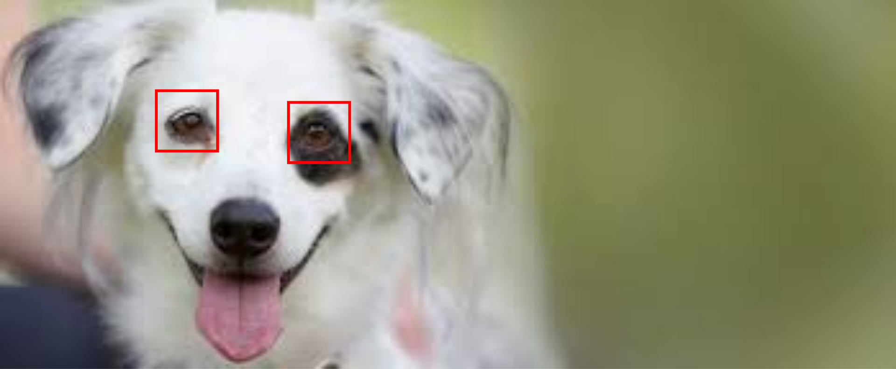
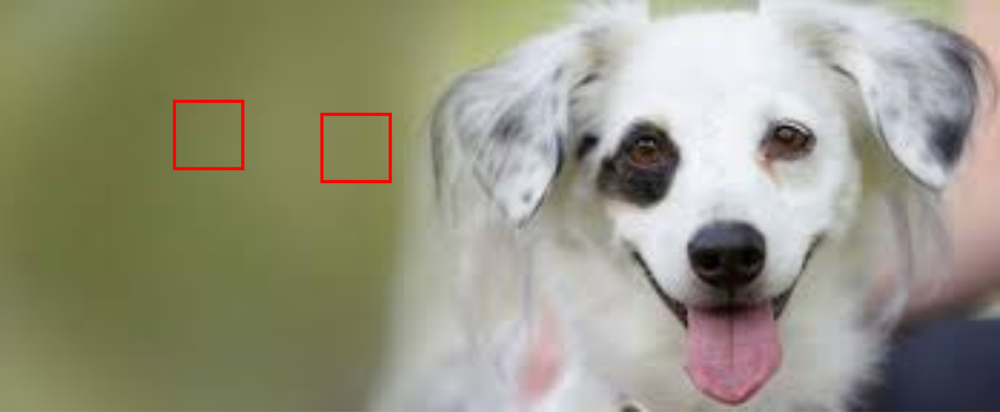
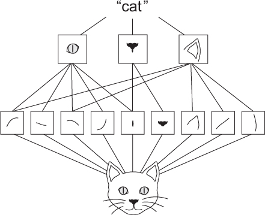
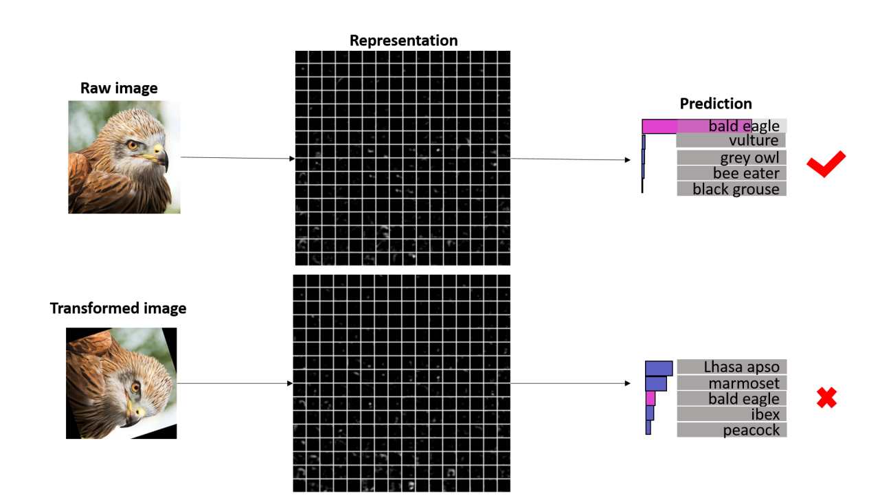

# Convolutional Neural Networks

Lukas Höhl, Yuki Shiono

---

## Inhaltsverzeichnis
1. Einleitung 
2. Grundlagen von Neural Networks
3. Convolutional Neural Networks
4. State of the Art
5. Ausblick

---

## Einleitung

* Kern von Deep Learning
* Nervensystem von Lebewesen als Vorbild
* Einsatzbeispiele: Bildklassifizierung von Google Images, Videoempfehlungen auf Youtube oder auch KIs für Brettspiele wie Go (AlphaGo von DeepMinds)

---

## Grundlagen von Neural Networks

Quelle: https://www.tibco.com/reference-center/what-is-a-neural-network

---

### Dense Layer
* ein mögliches Hidden Layer
* alle Neuronen sind mit allen Neuronen des vorherigen Layers verbunden
    * Fully Connected Layer
* wird zur Klassifikation genutzt
    * entsprechend Anzahl Neuronen gleich Anzahl Kategorien

---

## Convolutional Neural Networks

---

Quelle: https://jonathan-hui.medium.com/real-time-object-detection-with-yolo-yolov2-28b1b93e2088

---

* Conv Nets sind einer der Standards für Computer Vision Aufgaben
  * Objekterkennung, Bildklassifizierung etc.
* Bestehene im Kern aus 3 verschiedenen Layerarten
  * Convolutional Layer
  * Dense Layer
  * Pooling Layer

---

### Tensor

- vergleichbar mit einer multidimensionalen Matrix
- Inputwerte, Outputwerte und Parameter nutzen diese Form
- Farbbild wird bspw. als H x W x D Tensor abgebildet

---

### Convolutional Layer
- Zentrales Element des Conv Nets
- bekommt Feature Map (Eingabewerte) und gibt Response Map zurück
- verschiedene Filter zum Extrahieren von Bildinformationen
  - Pattern
- Convolutional Operation

---

- Feature Map wird in Segmente aufgeteilt 
- Skalarprodukt wird in Response Map geschrieben
- Dimension schrumpft!

Note: Größe spiegelt die Größe der Filter wieder

---

#### Padding

- Anhängen von Nullen an den Rand der Feature Map
- Dimension bleibt unverändert

---

### Pooling

- Dimension reduzieren
  - Minimierung der Komplexität
  - nächster Layer kann größeres Segment des Bildes betrachten
- Max Pooling und Average Pooling

---

### Training

- Architektur steht, jetzt müssen Parameter angepasst werden
  - Ziel: Bestmögliche Ergebnisse erzielen!
- Gradient Descent Methode
  - rekursiver Algorithmus
  - Loss Function

Note: Loss Function bewertet das Network auf Richtigkeit der Vorhersagen

---

#### Gradient Descent Methode

Note: Kurve ist Loss Function, wi ist parameter, g ist Gradient, misst den Zuwachs von der Loss Function mit Rucksicht auf Änderung der Parameter und wird auch Gradient genannt 

---

## Wieso Conv Nets?
- Dense Neural Networks können Pattern nur an einer bestimmten Stelle lernen

---

Quelle: https://colab.research.google.com/drive/1ZZXnCjFEOkp_KdNcNabd14yok0BAIuwS

- Dense Neural Network hat gelernt, wie Augen eines Hundes aussehen
- Was passiert wenn das Bild gespiegelt wird?

---

Quelle: https://colab.research.google.com/drive/1ZZXnCjFEOkp_KdNcNabd14yok0BAIuwS

- Pattern werden vom DNN nur global gelernt!

---

## Wieso Conv Nets?
- Conv Nets lernen Pattern lokal
  - richtige Klassifikation bei Änderung im Bild 

- Hierarchie Pattern

---

### Hierarchie Pattern

Quelle: Deep Learning with Python von Francois Chollet

---

### Probleme treten trotzdem auf

Quelle: Shen, Xu ; Tian, Xinmei ; He, Anfeng ; Sun, Shaoyan ; Tao, Dacheng: Transform-Invariant Convolutional Neural Networks for Image Classification and Search

---

#### TICNN

- Aufgrund des vorherigen Problems entstanden
- Transform-Invariant
- Zufällige Transformationen auf das Bild während des Trainings

🠆 Resistenter gegen Transformationen!

---

## State of the Art
* Einschränkung auf Image Classification
* Festlegung durch Benchmark-Datasets
    * Beispiele ImageNet, CIFAR-10, CIFAR-100, MNIST, etc.

---

### CIFAR-10
* 10 Kategorien (Flugzeug, Auto, Vogel, Katze, Reh, Frosch, Pferd, Schiff und LKW)
* je 6.000 Farbfotos (32x32 Pixel)

---

### ImageNet
* WordNet als Grundlage
* Ziel: 500-1000 hochauflösende Bilder pro Synset
* ImageNet Large Scale Visual Recognition Challenge
    * 1000 Kategorien aus dem Bestand 
    * keine Überlappung der Synset

---

## EfficientNet
* Grundarchitektur: 2019 von Mingxing Tan und Quoc Le
* im Zuge einer neuen Skalierungsmethode entwickelt
* höhere Genauigkeit mit weniger Parameter
* EfficientNet-L2 von Pierre Foret, Ariel Kleiner, Hossein Mobahi und Behnam Neyshabur aus dem Jahr 2020
    * aktuell bestabschneidenstes CNN in Benchmark mit CIFAR-10, CIFAR-100
    * EfficientNet als Basis

---

## Ausblick
* Transformer
    * Ursprung: Natural Language Processing
    * schneidet teilweise in Benchmarks besser als CNN ab
    * besonders für große Datasets geeignet
        * daher im Benchmark mit ImageNet besser als EfficientNet

