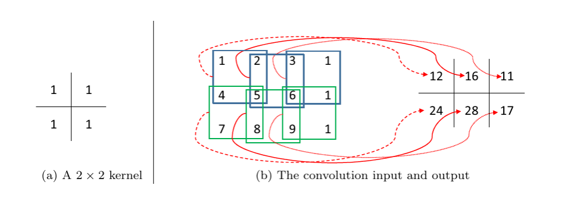

# Convolutional Neural Networks

Lukas Höhl, Yuki Shiono

---

## Inhaltsverzeichnis
1. Einleitung 
2. Grundlagen von Neural Networks
3. Convolutional Neural Networks
4. State of the Art
5. Ausblick

---

## Einleitung

* punkt 1
* punkt 2

---

## Grundlagen von Neural Networks

---

## Convolutional Neural Networks

---

Quelle: https://jonathan-hui.medium.com/real-time-object-detection-with-yolo-yolov2-28b1b93e2088

---

* Conv Nets sind einer der Standards für Computer Vision Aufgaben
  * Objekterkennung, Bildklassifizierung etc.
* Bestehene im Kern aus 3 verschiedenen Layerarten
  * Convolutional Layer
  * Dense Layer
  * Pooling Layer

---

### Tensor

- vergleichbar mit einer multidimensionalen Matrix
- Inputwerte, Outputwerte und Parameter nutzen diese Form
- Farbbild wird bspw. als H x W x D Tensor abgebildet

---

### Convolutional Layer
- Zentrales Element des Conv Nets
- bekommt Feature Map (Eingabewerte) und gibt Response Map zurück
- verschiedene Filter zum Extrahieren von Bildinformationen
  - Pattern
- Convolutional Operation

---

- Feature Map wird in Segmente aufgeteilt 
- Skalarprodukt wird in Response Map geschrieben
- Dimension schrumpft!

Note: Größe spiegelt die Größe der Filter wieder

---

#### Padding

- Anhängen von Nullen an den Rand der Feature Map
- Dimension bleibt unverändert

---

### Pooling

- Dimension reduzieren
  - Minimierung der Komplexität
  - nächster Layer kann größeres Segment des Bildes betrachten
- Max Pooling und Average Pooling

---

### Training

- Architektur steht, jetzt müssen Parameter angepasst werden
  - Ziel: Bestmögliche Ergebnisse erzielen!
- Gradient Descent Methode
  - rekursiver Algorithmus
  - Loss Function

Note: Loss Function bewertet das Network auf Richtigkeit der Vorhersagen

---

#### Gradient Descent Methode

Note: Kurve ist Loss Function, wi ist parameter, g ist Gradient, misst den Zuwachs von der Loss Function mit Rucksicht auf Änderung der Parameter und wird auch Gradient genannt 

---

## State of the Art

---

## Ausblick
